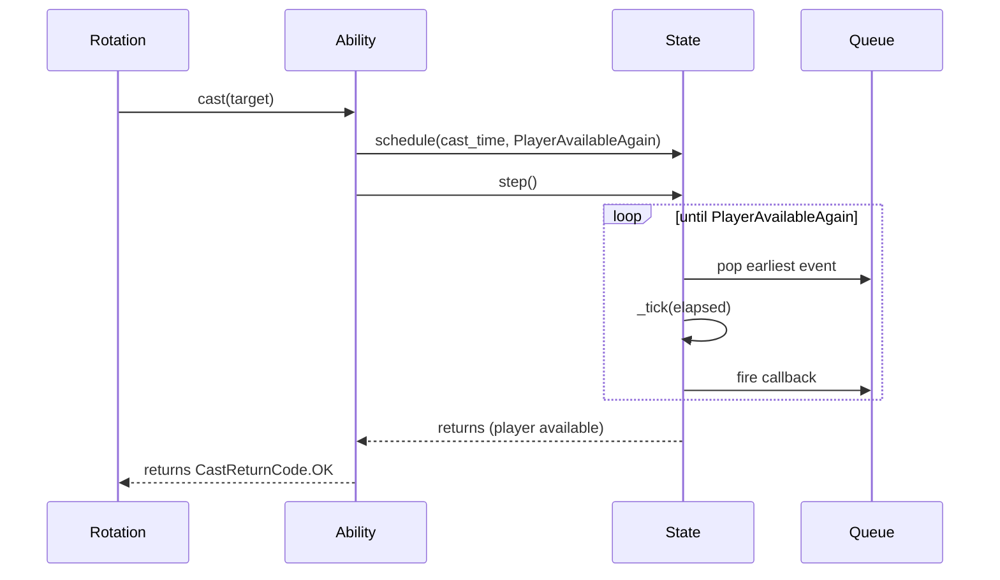
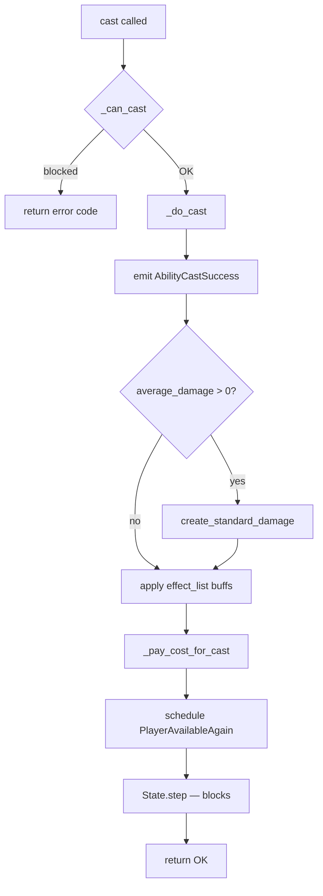
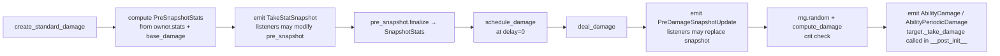
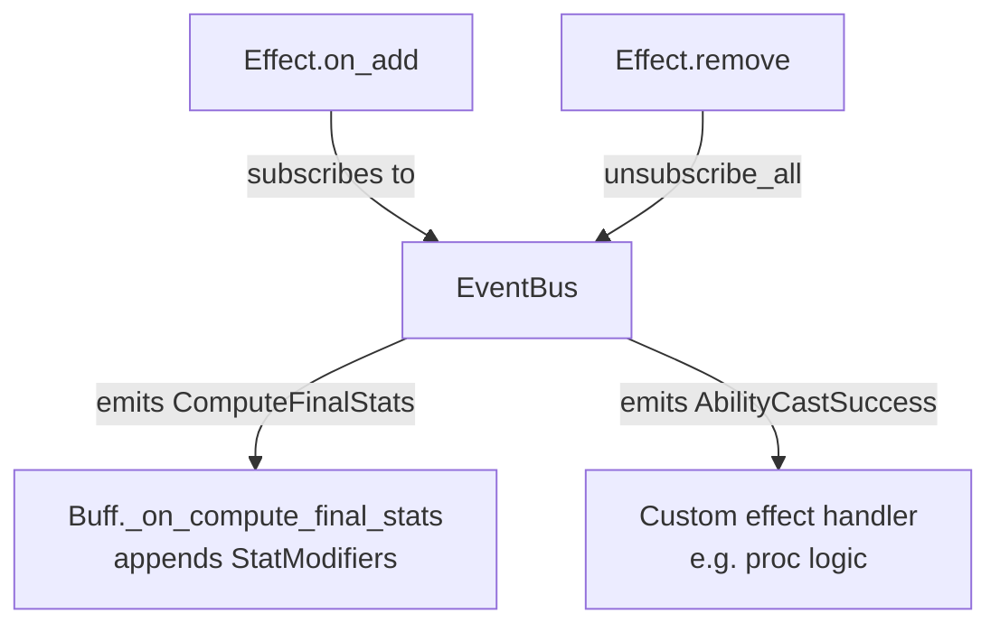
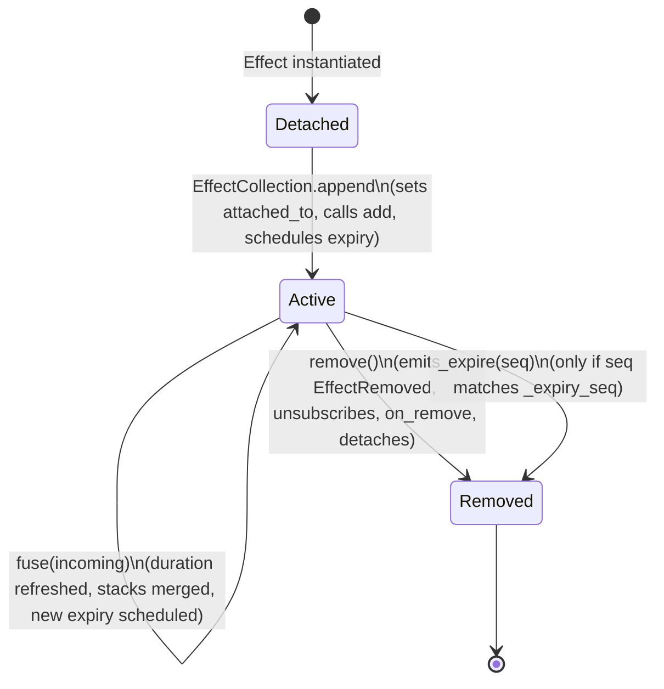
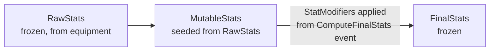
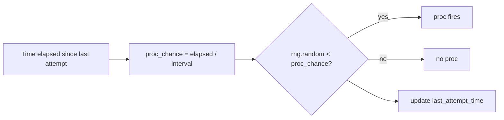
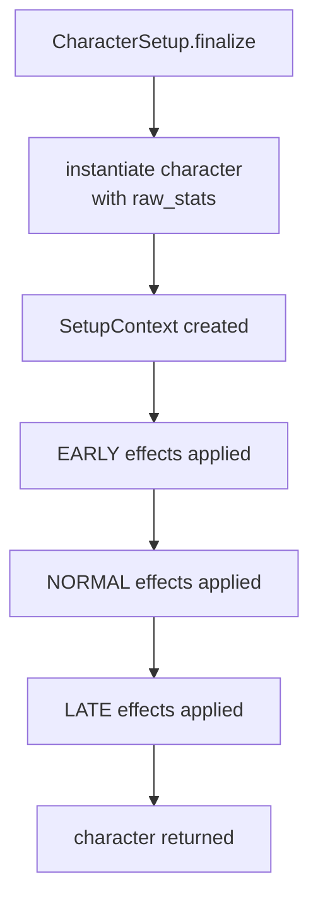

# Project architecture

## Table of contents

1. [State, event bus, timed events](#state-event-bus-timed-events)
2. [Ability cast](#ability-cast)
3. [Player, abilities, enemies, target selection, damage](#player-abilities-enemies-target-selection-damage)
4. [Effects: role, interaction with events](#effects-role-interaction-with-events)
5. [Effects: insertion on entity, lifecycle, removal](#effects-insertion-on-entity-lifecycle-removal)
6. [Effect collection API, handling duplicate effects](#effect-collection-api-handling-duplicate-effects)
7. [Stats: modification by buffs, effect on ability cooldown](#stats-modification-by-buffs-effect-on-ability-cooldown)
8. [Stats: effect on damage, cast time, damage-over-time tick rate](#stats-effect-on-damage-cast-time-damage-over-time-tick-rate)
9. [Randomness: role, mechanics (realPPM, flat procs, crits)](#randomness-role-mechanics-realppm-flat-procs-crits)
10. [Player setup: stats, setup effects](#player-setup-stats-setup-effects)
11. [Direct user interaction with the sim](#direct-user-interaction-with-the-sim)
12. [Indirect interaction: setup, scenario, rotation](#indirect-interaction-setup-scenario-rotation)
13. [Monte Carlo simulation: simulation result, metric, simulation result list ensemble](#monte-carlo-simulation)
14. [Temporary modifiers: implementation, interaction, uptime](#temporary-modifiers-implementation-interaction-uptime)
15. [Configuration](#configuration)


## Summary

The simulator is structured as a **discrete-event engine**. There is a single mutable `State` object that holds the simulation clock, a priority queue of future callbacks, an `EventBus` for reactive communication, and an RNG. A `Player` casts `Ability` instances on `Entity` targets; abilities and effects publish and consume events on the bus. Time only advances when the queue is drained to reach the next scheduled callback.

The two main concerns — **simulation infrastructure** (time model, events, state) and **game mechanics** (stats, damage, effects, abilities) — are kept deliberately separate so the engine can be reused for different characters and scenarios without touching the core loop.

The core usage loop is:

- Setup a game state with some number of dummy enemies.
- Setup a player character with gems, talents, legendary, etc.
- Cast abilities: `player.ability.cast()` is equivalent to the player casting the ability in game:
    - Compute damage.
    - Add any effects to player and enemies.
    - Move time until player becomes available again.

The user-facing loop operates as standard python and makes the underlying calculations invisible to the player.


## State, event bus, timed events

**Primary concern: simulation infrastructure.**

### State

`State` ([base_classes/state.py](../src/fellowship_sim/base_classes/state.py)) is the root of a simulation run. It holds:

| Field | Role |
|---|---|
| `time` | Current simulation clock (float, seconds) |
| `rng` | The single RNG object used by everything |
| `bus` | The `EventBus` |
| `enemies` | List of `Entity` targets |
| `character` | The active `Player` |
| `_queue` | Min-heap of `(trigger_time, seq, TimedEvent)` |

`State` must be activated with `.activate()` before the sim starts; this sets a module-level singleton so that events, effects, and abilities can call `get_state()` without passing the state everywhere.

`State.step()` is the main loop: it pops the earliest event, ticks all game objects by the elapsed time, advances the clock, fires the callback, and stops when a callback returns `True` (the `PlayerAvailableAgain` signal) or the queue is empty.

`State.advance_time(dt)` is a variant that processes all events up to `now + dt` without stopping on player-available; used for tests and explicit delays.

### Event bus

`EventBus` ([base_classes/events.py](../src/fellowship_sim/base_classes/events.py)) is the primary decoupling mechanism. Handlers subscribe per event type and are called synchronously when that type is emitted.

Handlers can optionally be registered under an **owner** object. All handlers for an owner can be bulk-unsubscribed with `unsubscribe_all(owner)` — this is how effects clean up when they expire. The implementation uses `id(owner)` rather than the object itself because mutable dataclasses are not hashable.

### Timed events

`TimedEvent` ([base_classes/timed_events.py](../src/fellowship_sim/base_classes/timed_events.py)) is a `Protocol`: any callable that returns `bool | None`. Returning `True` halts `State.step()` early. The built-in `PlayerAvailableAgain` timed event is the signal that the rotation may proceed.




## Ability cast

**Primary concern: game mechanics + simulation infrastructure.**

`Ability.cast(target)` ([base_classes/ability.py](../src/fellowship_sim/base_classes/ability.py#L80)) is the entry point for any player action. The steps are:

1. **Pre-cast checks** — `_can_cast()` walks the MRO and calls every method decorated with `@can_cast_check`. Built-in checks: cooldown/charges availability, spirit cost for ultimates. Subclasses add resource checks the same way.
2. **Resolve effects** — `_do_cast(target)` fires `AbilityCastSuccess`, deals damage (via `create_standard_damage`), applies any `effect_list` buffs on the caster, and fires `UltimateCast` if applicable.
3. **Pay costs** — `_pay_cost_for_cast(target)` deducts spirit, consumes a charge, and restarts the cooldown if charge slots remain unfilled.
4. **Wait** — schedules `PlayerAvailableAgain` at `now + cast_time`, then calls `State.step()`, which blocks until that callback fires.



Channel abilities follow the same flow but `cast_time` is the total channel duration; tick damage is scheduled internally during `_do_cast`.


## Player, abilities, enemies, target selection, damage

**Primary concern: game mechanics.**

### Player and Entity

`Entity` ([base_classes/entity.py](../src/fellowship_sim/base_classes/entity.py#L39)) is the base for everything that can hold effects and receive damage. It owns:
- `effects: EffectCollection` — active effects on this entity.
- `damage_tracker: DamageTracker` — running damage total, broken down by source.

`Player(Entity)` ([base_classes/entity.py](../src/fellowship_sim/base_classes/entity.py#L59)) adds:
- `raw_stats` — the immutable base stats from equipment.
- `stats: FinalStats` — computed stats (recalculated on every buff change).
- `abilities` — the list of `Ability` instances owned by this player.
- `spirit_points` / `max_spirit_points` / `spirit_ability_cost` — ultimate resource.
- Weapon ability slots (`weapon_ability`, `chronoshift`, etc.) — start as `WEAPON_ABILITY_NOT_INITIALIZED`.
- `wait(duration)` — advance time without casting.

### Target selection

`State.select_targets(main_target, num, priority_func)` ([base_classes/state.py](../src/fellowship_sim/base_classes/state.py#L128)) selects up to `num` enemies from the pool, excluding `main_target`. When a `priority_func` is provided, enemies are selected highest-priority first; ties within the cut are broken uniformly at random using `state.rng`.

### Damage pipeline



- `TakeStatSnapshot` — listeners can inject snapshot modifiers at cast time (e.g. a proc that boosts the snapshot for a specific ability).
- `PreDamageSnapshotUpdate` — fired just before the crit roll; listeners may replace the `SnapshotStats` to inject last-moment bonuses (e.g. a debuff on the target).
- `compute_damage` handles normal crits (`roll < crit_percent`) and **grievous crits** (`crit_percent >= 1.0`), where damage is `average * (1 + crit_percent) * crit_multiplier`.


## Effects: role, interaction with events

**Primary concern: game mechanics.**

An `Effect` ([base_classes/effect.py](../src/fellowship_sim/base_classes/effect.py#L24)) is a timed modifier attached to an entity. Effects interact with the rest of the sim exclusively through the event bus:

- **`Buff`** subscribes to `ComputeFinalStats` on add and appends `StatModifier` instances to the event, which are then applied by `Player._recalculate_stats()`.
- **`DotEffect`** schedules periodic `_fire_tick` callbacks on the queue and calls `deal_damage` on each tick.
- Custom effects can subscribe to any `SimEvent` in their `on_add()` method and clean up automatically via the owner-based `unsubscribe_all` when they are removed.




## Effects: insertion on entity, lifecycle, removal

**Primary concern: simulation infrastructure + game mechanics.**



Key points:
- `attached_to` is set by `EffectCollection.append`, not by the constructor.
- The expiry mechanism uses a **version counter** (`_expiry_seq`): when an effect is refreshed via `fuse`, the counter increments so that the old expiry callback is a no-op when it eventually fires.
- `on_add` / `on_remove` are hooks for subclasses; `Buff.on_remove` always calls `_recalculate_stats`.


## Effect collection API, handling duplicate effects

**Primary concern: simulation infrastructure.**

`EffectCollection` ([base_classes/effect.py](../src/fellowship_sim/base_classes/effect.py#L162)) is keyed by `effect.name` (a string). The public API:

| Method | Behaviour |
|---|---|
| `append(effect)` | If name absent: insert, call `add()`, schedule expiry. If name present: call `existing.fuse(incoming)`. |
| `remove(effect)` | Delete by name; `effect.attached_to` is cleared by `Effect.remove()`. |
| `get(name)` | Return effect or `None`. |
| `has(name)` | Existence check. |
| `__iter__` | Iterate over active effects. |

`Effect.fuse(incoming)` defines the merge logic:
- Infinite-duration effects raise `DuplicateEffectError` (they cannot stack with themselves).
- Finite-duration effects: duration is reset to `incoming.duration`; stacks are clamped to `max_stacks`.

Subclasses can override `fuse` for custom behaviour (e.g. a DoT that accumulates total remaining damage instead of simply refreshing).


## Stats: modification by buffs, effect on ability cooldown

**Primary concern: game mechanics.**

### Stat pipeline

Stats flow through three immutable → mutable → immutable stages:



1. `Player._recalculate_stats()` fires `ComputeFinalStats`.
2. Active `Buff` instances append their `StatModifier` list to the event.
3. `Player` seeds a `MutableStats` from `raw_stats`, applies all modifiers, calls `.finalize()` to produce a new `FinalStats`, and stores it as `player.stats`.
4. `_recalculate_cdr_multipliers()` is called immediately after to propagate any haste change to ability cooldown drain rates.

`StatModifier` subtypes ([base_classes/stats.py](../src/fellowship_sim/base_classes/stats.py#L128)):

| Modifier | Target field |
|---|---|
| `MainStatAdditiveCharacter` | `main_stat_additive_bonus` (+flat) |
| `MainStatAdditiveMultiplierCharacter` | `main_stat_additive_multiplier` (×, bucket 2) |
| `MainStatTrueMultiplierCharacter` | `main_stat_true_multiplier` (× independent) |
| `CritMultiplierMultiplicativeCharacter` | `crit_multiplier` (×) |
| `CritPercentAdditive` / `CritScoreAdditive` | `crit_percent` / `crit_score` |
| `ExpertisePercentAdditive` / `ExpertiseScoreAdditive` | `expertise_percent` / `expertise_score` |
| `HastePercentAdditive` / `HasteScoreAdditive` | `haste_percent` / `haste_score` |
| `SpiritPercentAdditive` / `SpiritScoreAdditive` | `spirit_percent` / `spirit_score` |

### Cooldown drain and haste

`Ability._tick(dt)` drains `cooldown` by `dt * _cdr_multiplier`. The multiplier is recomputed by `_recalculate_cdr_multiplier()` whenever stats change (via `Player._recalculate_cdr_multipliers()`).

`_compute_cooldown_reduction_and_acceleration()` fires `ComputeCooldownReduction`. The event accumulates:
- **CDA** (Cooldown Drain Acceleration) additive values — haste is injected here when `ability.has_hasted_cdr` is `True`.
- **CDR** (Cooldown Reduction) multiplicative values — e.g. a specific buff that reduces a particular ability's cooldown.

Effective multiplier: `(1 + Σ CDA) × Π CDR`.

`WeaponAbility` bypasses this entirely: weapon cooldowns always drain at 1 s/s regardless of haste or external CDR.


## Stats: effect on damage, cast time, damage-over-time tick rate

**Primary concern: game mechanics.**

### Damage scaling

The damage formula is encoded in `PreSnapshotStats.finalize()` ([base_classes/stats.py](../src/fellowship_sim/base_classes/stats.py#L348)):

```
average_damage = base_damage × (main_stat / 1000) × (1 + expertise_percent)
```

`base_damage` is the `Ability.average_damage` constant (or a per-tick value for DoTs). The result is stored in `SnapshotStats.average_damage`.

On the crit roll (`compute_damage` in [base_classes/combat.py](../src/fellowship_sim/base_classes/combat.py#L35)):
- Normal hit: `average_damage × 1`
- Crit: `average_damage × 2 × crit_multiplier`
- Grievous crit (crit_percent ≥ 1): `average_damage × (1 + crit_percent) × crit_multiplier`

### Cast time and haste

`Ability.cast_time` = `base_cast_time / (1 + haste_percent)`.
Channel abilities are exempt: their `cast_time` returns `base_cast_time` unchanged (tick interval is baked into the snapshot at cast time).

### DoT tick rate and haste

`DotEffect.on_add()` computes `_tick_duration = base_tick_duration / (1 + snapshot.haste_percent)`. Haste at cast time is snapshotted into the DoT and never updated for its lifetime — ticks fire at a fixed interval derived from cast-time haste.

If `does_partial_final_tick` is `True`, a fractional damage tick fires on removal, proportional to how far into the current tick window the effect was when it expired.


## Randomness: role, mechanics (realPPM, flat procs, crits)

**Primary concern: game mechanics.**

All randomness flows through `state.rng` (a `random.Random` instance or anything satisfying the `RNG` protocol: `def random() -> float`). No module-level `random` calls exist.

### Crits

Checked in `deal_damage` with a single `state.rng.random()` roll compared against `snapshot.crit_percent`.

### Flat proc chance

A direct `state.rng.random() < probability` test at the event handler. Used for abilities that proc on cast with a fixed percentage.

### RealPPM

`RealPPM` ([base_classes/real_ppm.py](../src/fellowship_sim/base_classes/real_ppm.py)) implements the *real procs per minute* mechanic: proc probability scales linearly with time elapsed since the last attempt, reaching 100% at exactly one proc interval. Optional scaling by haste and/or crit.

```
current_ppm = base_ppm × (1 + haste)? × (1 + crit)?
proc_interval = 60 / current_ppm
proc_chance = elapsed_since_last_attempt / proc_interval
```

`RealPPM.check()` rolls and always updates `last_attempt_time`, even on a miss.




## Player setup: stats, setup effects

**Primary concern: game mechanics + simulation infrastructure.**

Character configuration uses three layers in [base_classes/setup.py](../src/fellowship_sim/base_classes/setup.py):

| Class | Role |
|---|---|
| `SetupStats` | Plain dataclass: percent-valued stats. Also has `from_scores` to convert rating scores. `.to_raw_stats()` converts to `RawStatsFromPercents`. |
| `SetupEffect[TCharacter]` | Abstract base; `apply(character, context)` runs once at setup time. Ordered by `timing` (`EARLY < NORMAL < LATE`). |
| `CharacterSetup[TCharacter]` | Combines `SetupStats` and a list of `SetupEffect`; `.finalize()` instantiates the character and runs all effects in timing order. |

`SetupContext` is a shared namespace passed to every `SetupEffect.apply()`, allowing effects in different timing phases to communicate (e.g. an EARLY effect creates a permanent aura, a NORMAL effect configures it).



`SimpleEffectSetup` is a convenience `SetupEffectLate` that wraps a pre-built `Effect` instance and appends it to the character's effect collection.


## Direct user interaction with the sim

To explore or verify mechanics interactively:

```python
state = State(enemies=[Entity()]).activate()
setup = CharacterSetup(character_class=Elarion, setup_stats=SetupStats(...))
player = setup.finalize()
state.character = player

# Cast abilities directly — each call blocks until the player is available again
player.some_ability.cast(state.enemies[0])
player.wait(1.5)
player.another_ability.cast(state.enemies[0])

# Inspect results
print(state.enemies[0].damage_tracker.total)
print(state.enemies[0].damage_tracker.by_source)
```

`Ability.cast` returns `CastReturnCode.OK` on success, or `ON_COOLDOWN` / `INSUFFICIENT_RESOURCES` if the cast was blocked. The call is **synchronous** from the caller's perspective: it returns only once the player is available again.


## Indirect interaction: setup, scenario, rotation

WORK IN PROGRESS


## Monte Carlo simulation

WORK IN PROGRESS


## Temporary modifiers: implementation, interaction, uptime

Temporary modifiers are `Effect` subclasses (most commonly `Buff`) with a finite `duration`. They are active for the duration, modify stats or subscribe to events while active, and are automatically removed when they expire.

### Implementation

A buff contributes `StatModifier` instances via `stat_modifiers()`. These are collected by `ComputeFinalStats` and applied each time `Player._recalculate_stats()` runs. No running total is maintained: the full modifier list is recomputed from scratch on every recalculation.

Effects that are not stat-modifying buffs (e.g. DoTs, proc-triggering debuffs) subscribe to specific bus events in `on_add` and clean up via `unsubscribe_all` in `remove`.

### Interaction between modifiers

Multiple buffs coexist as long as their names differ. The order of `StatModifier` application follows the order effects were appended to the `ComputeFinalStats` event (subscription order). Multiplicative modifiers (`MainStatTrueMultiplierCharacter`, `CritMultiplierMultiplicativeCharacter`) are independent of the additive ones and compose correctly because they target separate `MutableStats` fields that are multiplied together in `finalize()`.

### Uptime

There is no built-in uptime tracker. To measure uptime, a custom `SetupEffect` can subscribe to `EffectApplied` / `EffectRemoved` and record timestamps against `state.time`.


## Configuration

`config.py` ([base_classes/config.py](../src/fellowship_sim/base_classes/config.py)) contains `IMPORTANT_EFFECTS`: a list of effect names for which `EffectApplied`, `EffectRefreshed`, and `EffectRemoved` are logged at `INFO` level rather than `DEBUG`. All other configuration (stat values, rotation logic, scenario parameters) lives in the caller code or in `CharacterSetup` instances.
