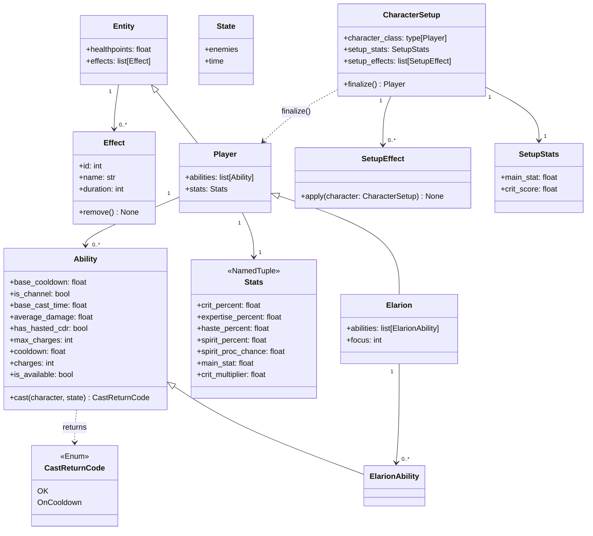

# Project architecture

## Single simulation run

### Key classes

```python
Entity:

- healthpoints: float
- effects: list[Effect]


Player(Entity):

- abilities: list[Ability]
- stats: Stats

Elarion(Player)

- abilities: list[ElarionAbility]
- focus: int


@dataclass(frozen=True)
Stats()
- crit_percent: float
- expertise_percent: float
- haste_percent: float
- spirit_percent: float
- spirit_proc_chance: property float
- main_stat: float
- crit_multiplier: float


CharacterSetup:

- character_class: type[Player]
- setup_stats: SetupStats
- setup_effects: list[SetupEffect]

# Build playable player from self
- finalize(self) -> Player


SetupStats:

- main_stat: float
- crit_score: float
- ...

SetupEffect:

# Modify character by applying side effects
- apply(character: CharacterSetup) -> None

Effect:

# NB: tricky to integrate since they need to listen to all events but they are still attached to a specific entity
- ID: unique_int  # To remove from listeners in future
- name: str
- duration: int

# TBD
# - handle_event(Event)
- remove(self)


State:

- enemies
- time


Ability:

# Static info
- base_cooldown: float
- is_channel: bool
- base_cast_time: float
- average_damage: float
- has_hasted_cdr: bool
- max_charges: int

# Dynamic info
- cooldown: float
- charges: int

# Properties
- is_available: bool

# Modify self, character and state as a side effect
- cast(self, character: Character, state: State) -> CastReturnCode


CastReturnCode(Enum)
- OK
- OnCooldown
```

#### Class diagram



### Desired code for rotation implementation

```python
# Implementing a simple rotation in pseudo-code


def rotation(elarion: Elarion, state: State):
    num_enemies = state.num_enemies

    if num_enemies >= 4:
        elarion.volley.cast()  # Using an ability updates the status of the character object elarion + state
        assert state.enemies[0].damage > 0
        assert state.time == 1.2
        assert elarion.volley.cooldown == 28.8
        elarion.lunarlight_mark.cast()
        assert state.enemies[0].effects.has(LunarlightMarkEffect)
        elarion.heartseeker_barrage.cast()

        if elarion.volley.info.available:
            elarion.volley.cast()

    # Priority queue
    while True:
        mark_then_barrage = Sequence(elarion.lunarlight_mark, elarion.heartseeker_barrage, reset=True)
        mark_then_barrage.cast()
        elarion.volley.cast()
        elarion.heartseeker_barrage.cast()
        Conditional(elarion.effects.has(FerventSupremacyBuff), elarion.multishot).cast()
```


### Event bus

#### Rust-style events in Python

Python has no native tagged-union enums with payloads. The idiomatic substitute is a **Union of dataclasses**, one per variant, with `isinstance` dispatch. This gives full type-safety and is compatible with Python 3.9.

```python
# Each variant is a plain dataclass — the "enum" is the Union alias
from __future__ import annotations
from dataclasses import dataclass
from typing import Union


@dataclass(kw_only=True)
class AbilityCast:
    ability: Ability
    character: Player


@dataclass(kw_only=True)
class BuffAcquired:
    buff: Effect
    character: Entity


@dataclass(kw_only=True)
class BuffExpired:
    buff: Effect
    character: Entity


@dataclass(kw_only=True)
class DamageDealt:
    source: Ability
    target: Entity
    amount: float


SimEvent = Union[AbilityCast, BuffAcquired, BuffExpired, DamageDealt]


# Dispatch
def handle(event: SimEvent) -> None:
    match event:
        case AbilityCast():
            ...
        case BuffAcquired():
            ...
```

#### Bus design

```python
EventHandler = Callable[[SimEvent], None]


class EventBus:
    # Registered handlers per event type
    _handlers: dict[type[SimEvent], list[EventHandler]]

    def subscribe(self, event_type: type[SimEvent], handler: EventHandler) -> None: ...

    # Remove all handlers registered by a given owner object.
    # Effects call this from their remove() to clean up their subscriptions.
    def unsubscribe_all(self, owner: object) -> None: ...

    def emit(self, event: SimEvent) -> None: ...
```

**Ownership / lifetime contract:**
- `Effect.__post_init__` (or an explicit `Effect.register(bus)` call) subscribes handlers.
- `Effect.remove()` calls `bus.unsubscribe_all(self)`.
- The `EventBus` is owned by `State` and passed into every `cast()` call.

#### Events needed for Celestial Impetus

| Event | Emitted by | Consumed by |
|---|---|---|
| `AbilityCast(FocusedShot, elarion)` | `FocusedShot.cast` | proc roll → may emit `BuffAcquired` |
| `BuffAcquired(CelestialImpetus, elarion)` | proc handler | appended to `elarion.effects` |
| `AbilityCast(CelestialShot, elarion)` | `CelestialShot.cast` | `CelestialImpetus` effect → doubles damage, emits `BuffExpired` |
| `BuffExpired(CelestialImpetus, elarion)` | `CelestialImpetus` handler | removed from `elarion.effects` |

#### Diagram
